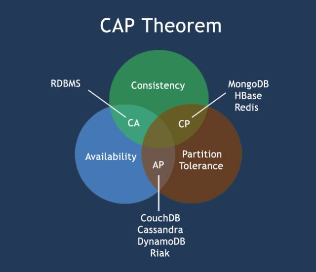
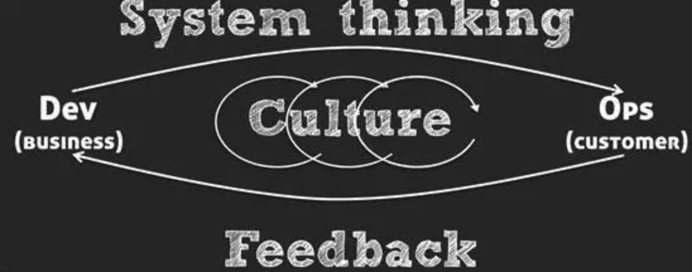

# 后端架构师知识能力图谱

## 架构原则
### 软件设计原则
#### 1. GRASP 通用职责分配软件模式
> 来自 Craig Larman 的软件设计书《 UML 和模式应用》，Larman 在书中提出软件设计的关键任务是职责分配，并提炼总结出 9 种 (5 种核心 +4 种扩展) 软件职责分配模式，这些模式是比 GoF 设计模式更抽象的元模式。

1. 信息专家 (Information Expert)
2. 创建者 (Creator)
3. 低耦合 (Low Coupling)
4. 高内聚 (High Cohesion)
5. 控制器 (Controller)
6. 多态 (Polymorphism)
7. 纯虚构 (Pure Fabrication)
8. 间接 (Indirection)
9. 受保护的变化 (Protected Variation)

#### 2. SOLID 面向对象设计原则
> S.O.L.I.D 是面向对象设计和编程 (OOD&OOP) 中几个重要原则的首字母缩写

1. 单一职责原则 (The Single Responsibility Principle)
2. 开放封闭原则 (The Open Closed Principle)
3. 里氏替代原则 (The Liskov Substitution Principle)
4. 依赖倒置原则 (The Dependency Inversion Principle)
5. 接口分离原则 (The Interface Segregation Principle)

### 分布式系统架构设计原则

#### 1. AKF 架构原则
> 共15 个架构原则，来自《架构即未来 (The Art of Scalability)》一书，作者马丁 L. 阿伯特和迈克尔 T. 费舍尔分别是 eBay 和 PayPal 的前 CTO，他们经历过 eBay 和 PayPal 大规模分布式电商平台的架构演进，在一线实战经验的基础上总结并提炼出 15 条架构原则。

1. N + 1 设计
2. 回滚设计
3. 禁用设计
4. 监控设计
5. 设计多活数据中心
6. 使用成熟的技术
7. 异步设计
8. 无状态系统
9. 水平扩展而非垂直升级
10. 设计时至少要有两步前瞻性
11. 非核心则购买
12. 使用商品化硬件
13. 小构建、小发布和快试错
14. 隔离故障
15. 自动化

*消化吸收这 15 条原则，基本可保系统架构不会有原则性问题；这 15 条原则同样适用于现在的微服务架构。*

#### 2. 12 要素应用
> Heroku 是国外知名的云应用平台。基于上百万应用的托管和运营经验，创始人 Adam Wiggins 提出了 12 要素应用宣言。简单讲，满足这 12 个要素的应用是比较容易云化并居住在 Heroku 平台上的。

1. 基准代码——一份基准代码，多份部署
2. 依赖——显式声明依赖。
3. 配置——在环境中存储配置。现在采用集中式配置中心也是一种流行方式。
4. 后端服务——把后端服务 (例如缓存，数据库，MQ 等) 当作附加资源，相关配置和连接字符串通过环境变量注入，或者采用配置中心。
5. 构建、发布和运行——严格分离构建和运行。
6. 进程——一个或者多个无状态的进程运行应用。
7. 端口绑定——通过端口绑定提供服务。
8. 并发——通过进程模型进行扩展。
9. 易处理——快速启动和优雅终止可最大化健壮性。
10. 开发环境和线上环境等价——尽可能保持开发、测试、预发和线上环境相同。
11. 日志——把日志当作数据流。
12. 管理进程——后台管理任务当作一次性的进程

*12 要素应用也是当前云原生应用 (Cloud Native App) 的参考标准。满足这 12 个要素的应用，可以比较顺利迁移到各种云平台 (Kubernetes, Marathon, Cloud Foundry 等) 上; Docker 容器技术可以认为是为云迁移量身定制的技术。容器化是后续云迁移的捷径，所以遗留应用改造可以先想办法做到容器化*

#### 3. CAP 定理
> 2000 年 7 月，加州大学伯克利分校的 Eric Brewer 教授在 ACM PODC 会议上提出 CAP 猜想。2 年后，麻省理工学院的 Seth Gilbert 和 Nancy Lynch 从理论上证明了 CAP。之后，CAP 理论正式成为分布式计算领域的公认定理。
>
> CAP 认为：一个分布式系统最多同时满足一致性 (Consistency)，可用性 (Availability) 和分区容忍性 (Partition Tolerance) 这三项中的两项。

1. 一致性 (Consistency)
2. 可用性 (Availability)
3. 分区容忍性 (Partition tolerance)

#### 4. BASE 理论
> eBay 架构师 Dan Pritchett 基于对大规模分布式系统的实践总结，在 ACM 上发表文章提出了 BASE 理论，BASE 理论是对于 CAP 理论的延伸，核心思想是即使无法做到强一致性 (Strong Consistency，CAP 中的一致性指强一致性)，但是可以采用适当的方式达到最终一致性 (Eventual Consistency)。
>
> BASE 指基本可用 (Basically Available)、软状态 (Soft State) 和最终一致性 (Eventual Consistency)。

1. 基本可用 (Basically Available)
2. 软状态 (Soft State)
3. 最终一致性 (Eventual Consistency)

*选择使用分布式产品时，比如 NoSQL 数据库，你需要了解它在 CAP 环中所在的位置，确保它满足你的场景需要。*

### 组织和系统改进原则
#### 1. 康威法则
> Melvin Conway 在 1967 年提出所谓康威法则，指出组织架构和系统架构之间有一种隐含的映射关系：Organization which design system […] are constrained to produce designs which are copies of the communication structures of these organization. 
> 康威法则也可以倒过来阐述：Conway’s law reversed：You won’t be able to successfully establish an efficient organization structure that is not supported by your system design(architecture)

*康威法则是微服务架构背后的组织原则*

#### 2. 系统改进三原则
> IT 运维管理畅销书《凤凰项目》的作者 Gene Kim 在调研了众多高效能 IT 组织后总结出支撑 DevOps 运作的三个原理 (The Three Ways: The Principles Underpinning DevOps)

1. 系统思考 (System Thinking)
2. 强化反馈环 (Amplify Feedback Loops)
3. 持续试验和学习的文化 (Culture of Continual Experimentation And Learning)

## 架构设计方法
### 1. 架构设计流程
1. 设计架构的时候，首先要分析出系统的复杂性。
2. 架构师根据自己对业务的理解，挑选合适的架构模式进行组合，再对组合后的方案进行修改和调整。
3. 通过360度环评的方式来评估备选方案。
   * 备选方案的数量以3～5个备选方案为最佳。
   * 备选方案的差异要比较明显。
   * 备选方案的技术不要只局限于已经熟悉的技术。
   * 按照质量属性的优先级来判断备选方案的优劣。
   * 架构师需要对技术的细节和原理有较深入的理解，避免成为“PPT架构师”。
   * 通过分步骤、分阶段、分系统等方式，尽量降低方案复杂度。
   * 采取设计团队的方式来进行设计，可以博采众长，汇集团队经验，减少思维和经验盲区。

### 2. 高可用设计方法
#### 1.存储高可用
1. 主备架构
   * ”备机“主要还是起一个备份作用，并不承担实际的业务读写操作。

2. 主从架构
    * 主机负责读写操作，从机只负责读操作，不负责写操作。
    * 主备倒换和主从倒换架构的复杂点主要体现在：状态判断、倒换决策和数据冲突修复三方面。

3. 主主复制架构
   * 必须保证数据能够双向复制，而很多数据是不能双向复制的。

4. 集群
    * 根据集群中机器承担的不同角色来划分，集群可以分为两类：数据集中集群、数据分散集群。
    * 数据集中集群可以看作一主多备或一主多从，但复杂度比主备或主从要高出很多。
    * 数据分散集群中每台服务器都会负责存储一部分数据和同时也会备份一部分数据。
5. 数据分区
    * 数据分区主要应对地理级别的故障。
    * 数据分区的复制规则分为集中式、互备式和独立式。
  
#### 2.计算高可用
1. 主备架构是计算高可用最简单的架构，可以细分为冷备结构和温备架构，常用温备架构。
   
    计算高可用的主备架构也比较适合与内部管理系统、后台管理系统这类使用人数不多、使用频率不高的业务，不太适合在线的业务。

2. 主从架构
 
   主从架构与主备架构相比，发挥了硬件的性能，但设计要复杂一些。

3. 高可用计算的集群

    * 高可用计算的集群根据集群中服务器节点角色的不同，可以分为对称集群和非对称集群。
    * 对称集群中每台服务器的角色都是一样的，都可以执行所有任务。
    * 非对称集群中的服务器分为多个不同的角色，不同角色执行不同的任务。
    * 非对称集群相比负载均衡集群，设计复杂度主要体现在任务分配策略和角色分配策略会更加复杂。

#### 3.业务高可用
1. 异地多活架构
    * 保证核心业务的异地多活、保证核心数据最终以执行、采用多种手段同步数据、只保证绝大部分用户的异地多活。
2. 接口级故障的主要应对方案：降级、熔断、限流、排队
    * 降级的核心思想就是丢车保帅，优先保证核心业务;
    * 限流指只允许系统能够承受的用户量进来访问，超出系统访问能力的用户将被抛弃;
    * 排队实际上是限流的一个变种，限流是直接拒绝用户，排队是让用户等待很长水间。

### 3. 高性能设计方法
#### 1.存储高性能
1. 读写分离
    * 高性能数据库集群的第一种方式是“读写分离”，其本质是将访问压力分散到集群中的多个节点，但是没有分散存储压力。
    * 数据库读写分流需要考虑“复制延迟”带来的复杂性。
    * 数据库读写分离的分配机制有两种方式：程序代码封装和中间件封装。

2. 分库分表
   * 高性能数据库集群的第二种方式是“分库分表”，就可以分散访问压力，又可以分散存储压力。
    * 业务分库指的是按照业务模块将数据分散到不同的数据库服务器。
    * 业务分库会引起join操作问题、事务问题、成本问题三个复杂度相关的问题。
    * 数据库分表分为垂直分表和水平分表。
    * 垂直分表引入的复杂性主要体现在表操作的数量要增加。
    * 水平分表引入了路由、join操作、count()操作、order by操作等复杂度问题。
3. 缓存
    * 缓存穿透是指业务系统查询的数据在缓存系统中没有的时候，每次查询都会访问存储系统。
    * 缓存雪崩是指当缓存失效（过期）后引起系统性能急剧下降的情况。
    * 缓存热点指大部分甚至所有业务请求都命中同一份缓存数据。
4. 善用存储引擎
    * K-V存储在数据结构方面相比关系型数据库具备较大优势。
    * 文档数据库最大的特点就是no-schema，可以存储和读取任意的数据。
    * 列式存储在某些场景下能够大大节省I/O。
    * 列式存储具备很高的压缩比，能够节省存储空间。
    * 全文搜索引擎的基本源流是倒排索引。
    * 为了让全文搜索引擎支持关系型数据的全文搜索，需要做一些转换操作，即将关系型数据转换为文档数据。

#### 2.计算高性能
1. 常用计算模型
    * RPC模型：每次有新的连接就新建一个进程去专门处理这个连接请求。
    * TPC模型：每次有新的连接就新建一个线程去专门处理这个连接的请求。
    * Reactor模型的基础是I/O多路复用。
    * Proactor模型是非阻塞异步网络模式。
2. 负载均衡
    * 常见的负载均衡系统有3种：DNS负载均衡、硬件负载均衡和软件负载均衡。
    * 硬件负载均衡用于实现集群级别的负载均衡。
    * 软件负载均衡用于实现机器级别的负载均衡。
    * 负载均衡算法分为：任务平分类、负载均衡类、性能最优类和Hash类。

### 4.可扩展设计方法
> 真正有生命力的软件系统都是在不断迭代和发展的。
> 所有可扩展性架构设计，背后的基本思想都可以总结为一个字：拆。
> 不同的拆分方式将得到不同的系统架构。

1. 面向流程拆分：分层架构
2. 面向服务拆分：SOA、微服务。
3. 面向功能拆分：微内核架构。

## 架构模式
### 1. 分层架构

### 2. 微服务架构

### 3. SOA架构

### 4. 微内核架构

## 架构工具

## 解决方案
### 性能调优

### 高可用

### 可扩展

### 如何评估新技术

## 软件工程
### DevOps

### CI/CD

### 工程师文化

## 注意事项

## 参考资料
1. [架构师必须知道的架构设计原则](https://mp.weixin.qq.com/s/03wnIHoAe6VyiMur0UvZHA)
2. [架构设计原则整理](https://zhuanlan.zhihu.com/p/150168153)
